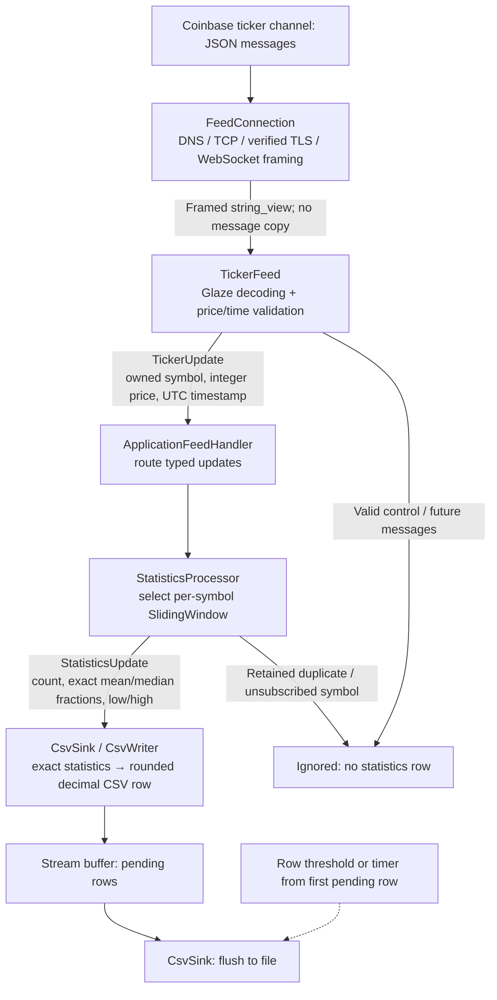
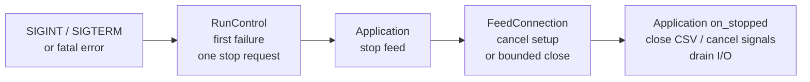

# Design decisions and tradeoffs

One thread runs one Asio event loop. Networking is asynchronous; decoding,
exact statistics and sink delivery run synchronously in arrival order.

## Event flow

The handler passes the returned statistics to the sink. `Result<T>` carries
immediate errors; the feed reports failures before transport cleanup. Timer-flush
errors report through `RunControlHandle` after the original write returns.

## Choices at a glance

| Choice | Benefit | Cost / limit |
| --- | --- | --- |
| One asynchronous event loop | Ordered updates, idle flush timers and signal shutdown without locks. | Lifetime coordination; synchronous processing and disk I/O delay all callbacks. |
| One ticker connection | Small configuration and lifecycle. | No load distribution; multiple connections require future coordination. |
| Separate transport, protocol, statistics and sink | Reusable modules with explicit ownership; concepts check delivery contracts. | Compile-time wiring and template compilation; private transport callbacks use type erasure. |
| Glaze typed JSON boundary | No DOM; module-owned mappings; complete values or typed errors. | Two scans for ticker dispatch; owned decoded strings and template compilation still cost resources. |
| Exact deque + two multisets + retained-ID index | Readable expiration, duplicate filtering and exact median/extrema. | O(N) dynamically allocated storage; no pool or preallocated ring. |
| Configurable observation limit | Explicit resource policy without silently losing samples. | Limits sample count, not process bytes; reaching it ends the run. |
| Eight-decimal integer prices + 128-bit sum | Exact stored prices and fractions; bounded CSV rounding. | Fixed supported grid/range and wider integer division during formatting. |
| Plain decimal price parsing; Boost.DateTime timestamps | Small field parsers using existing library facilities. | No scientific prices or timezone offsets; Boost needs guards, string copies and exception translation. |
| CSV row/time batching on the event loop | Continuous output with fewer flushes and no extra queue/thread. | Delayed visibility/error detection; slow I/O stalls processing; flush is not durability. |
| Strict failures; preserve first error | Predictable policy and useful root-cause reporting through cleanup. | No reconnect, recovery or best-effort continuation after malformed data. |
| Validated startup settings with defaults | Configurable operation; modules own their validation rules. | Settings are mutable aggregates; direct construction/edits need validation. |
| Lifecycle diagnostics to stderr | One log stream; CSV already records accepted updates. | Synchronous, best-effort logging; collection and rotation are external. |

## Ownership and extensibility

`Application` owns the feed, sink, handler, signals and run control. The handler
owns statistics; windows own their samples/indexes. `CsvSink` owns the file and
timer; `CsvWriter` borrows its stream. Borrowed dependencies outlive pending I/O;
message views are consumed synchronously. Statistics has no I/O dependency, and
the sink has no feed dependency.

`RunControl` owns run state, first failure and application-supplied stop policy.
`RunControlHandle` borrows that policy without owning state or an executor.
Dependencies bind at construction rather than travel with every event.

- **New feeds:** reuse `FeedConnection`, providing subscription encoding and a
  protocol adapter; other payloads need their own typed contract or conversion.
- **New sinks:** implement `write_statistics(update) -> Result<void>` and reuse
  the templated handler. Application wiring supplies configuration and lifecycle.
- **Multiple connections:** a future manager can own symbol groups on the same
  event loop, sharing run control. It must aggregate readiness/completion and
  close shared output after every feed stops; handles do not coordinate that.

Coinbase's [best practices](https://docs.cdp.coinbase.com/exchange/websocket-feed/best-practices)
recommend distributing subscriptions across connections to spread inbound load,
especially for the full channel. The submission keeps one ticker connection;
these boundaries permit extension without implementing a manager now.

## Configuration and input contracts

`load_config()` parses/validates a file string and resolves relative output paths.
The startup copy keeps files and WebSocket views on one JSON boundary. Modules
own their mappings; domain types remain independent of serialization.

`symbols` and `output.path` are required. Endpoint, window duration, observation
limit, message size, deadlines and flush settings are configurable; see
[Configuration](CONFIGURATION.md) for defaults, ranges and validation policies.

Unknown keys are ignored but validated syntactically; malformed, missing-required
or trailing input fails. Nesting is limited to 256 levels. Repeated valid keys
use the last value; sections replace rather than merge. Invalid earlier values
still fail. Checked integer conversion follows the spelling policy in the
configuration reference.

Ticker dispatch reads the type before decoding fields: an extra O(message-size)
scan keeps filtering/error descriptions straightforward; domain conversion runs
once. Malformed data and Coinbase errors are fatal; valid control/future messages
are ignored.

## Statistics and memory

Windows use each symbol's exchange time and the open lower boundary
`(t-duration, t]`. Each received ticker contributes one equally weighted price;
Coinbase can [batch cascading matches](https://docs.cdp.coinbase.com/exchange/websocket-feed/channels#ticker-channel),
so this is neither a complete trade tape nor a volume-weighted average.

Expiring K observations and inserting one costs O((K+1) log N); snapshots cost
O(1). Retained duplicates do not mutate state; IDs may be reused after expiration.
Decreasing timestamps fail; idle symbols produce no synthetic rows. Capacity is
checked after prospective expiration, before mutation. The default 100,000-sample
limit is an operational choice, not a measured rate budget.

The assignment permits bounded-error approximation. Alternatives considered were
**time buckets** (approximate expiration at the boundary), **price histograms**
(quantization error plus range/expiration policy), and **quantile sketches or
sampling** (rank/probabilistic guarantees, not universal price-error bounds).
Expiration, duplicates and extrema complicate these alternatives. Exact windows
keep one policy, accepting O(N) memory and failure at capacity. Allocation failure
is fatal; recovery is not promised.

## Numeric model

Prices are nonnegative signed 64-bit ticks: `1 tick = 0.00000001`, with range
`0..92233720368.54775807`. Matching-engine-style parsing splits decimal parts,
uses `std::from_chars` and checks before combining. Decimal points require digits
on both sides; insignificant trailing zeros are accepted, off-grid values rejected.
Scientific notation is deliberately unsupported, although Coinbase's
[types documentation](https://docs.cdp.coinbase.com/exchange/rest-api/types)
does not explicitly prohibit it.

Boost.DateTime handles calendar conversion and fractional seconds, configured
for nanoseconds only inside `parse_fields.cpp`. Guards preserve the strict UTC
layout, 1970..2200 range and up to nine fractional digits, preventing normalization
and truncation. Library exceptions become typed errors. Temporary strings and
exception translation are the cost of reusing Boost.

The allocation-free 128-bit sum is exact: supported price times count fits in
127 bits. Mean stays sum/count; even-count median stays the middle prices/2.
Only CSV rounds, using nearest, ties-to-even.
**Mean and median have absolute output error at most half a tick (`0.000000005`);
observed prices, low and high are exact.** This bound covers received updates,
not omitted trades. Locale-independent decimals omit insignificant trailing zeros.

One scale avoids product-metadata lookup and per-symbol settings. Products whose
[`quote_increment`](https://docs.cdp.coinbase.com/api-reference/exchange-api/rest-api/products/get-single-product)
requires finer prices are unsupported; representability is not guaranteed for
all current or future products.

## Output, shutdown and scope

Output opens after subscription writing, preserving previous CSV on earlier
failures; readiness does not wait for acknowledgement. Opening replaces the file
and flushes its header. Rows flush at the threshold or interval from the first
pending row; later rows do not postpone it. Shutdown flushes the remainder.
Stream buffering may publish rows earlier; scheduling bounds are not hard real-time.

An SPSC queue/writer thread could isolate I/O, but needs saturation policy,
cross-thread errors and draining. Batching keeps single-thread ownership instead.
Emitted counts need not equal persisted rows after failure; crashes or SIGKILL
can lose pending output.

TLS verifies chain and hostname using the environment's trust store. Deadlines
cover DNS through subscription and close; there is no idle watchdog. Normal peer
close succeeds; close failure returns an error. No unsubscribe is needed. Cleanup
errors are logged without replacing the first failure. Emergency exception cleanup
can abandon the close handshake.

Reconnects, sequence recovery, heartbeats, workers, queues, runtime reload and
crash durability are outside scope. Logging records UTC lifecycle events and final
counts, with INFO and ERROR both on stderr; per-ticker diagnostics are omitted.
The submission makes no measured low-latency performance claim.

## Verification approach

Tests exercise production APIs, randomized windows against a sorted reference,
fixtures and independent Decimal CSV checks. Local TLS tests cover trust,
cancellation, shutdown deadlines, first-error preservation and batch visibility.
They need loopback access, not an external feed.

[Release/UBSan results](../logs/test-results.log), [live diagnostics](../logs/live-run.log)
and [independent live verification](../logs/live-verification.log) retain execution
evidence. Deterministic tests cover expiration beyond the short live capture.
ASan cannot initialize on this host; Linux CI runner results remain unconfirmed.
Generated artifacts stay in ignored `build/`; `logs/` retains current evidence.
See [Build setup](BUILDING.md).
