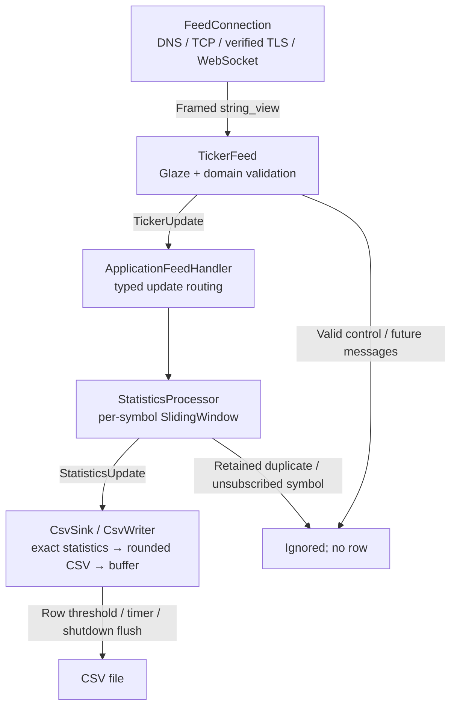
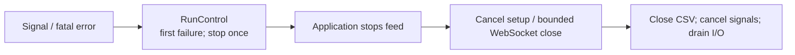

# Design decisions and tradeoffs

## Event flow

- One Asio thread; asynchronous networking, synchronous decoding/statistics/output.
- Immediate failures use `Result<T>`; timer-flush failures report through `RunControlHandle`.

## Choices at a glance

| Choice | Benefit | Tradeoff |
| --- | --- | --- |
| One asynchronous event loop | Timers and graceful shutdown without locks. | Synchronous work delays all callbacks; lifetimes need coordination. |
| One ticker connection | Simple configuration/lifecycle. | No load distribution; multiple feeds need coordination. |
| Separate modules; concept-based contracts | Explicit ownership and reusable feeds/sinks. | Compile-time wiring; private transport callbacks use type erasure. |
| Deque + two multisets + retained-ID index | Readable exact expiration, median and duplicate filtering. | O(N) allocated storage; no pool/ring. |
| Configurable observation cap | No silent sample loss. | Bounds samples, not process bytes; reaching capacity ends the run. |
| Eight-decimal prices; 128-bit sum | Exact stored values/fractions. | Fixed range/grid; wider division during formatting. |
| CSV row/time batching | Continuous output, fewer flushes, no writer thread. | Slow I/O stalls processing; delayed visibility/errors; no durability guarantee. |
| Strict failures; first error retained | Predictable policy and useful root cause. | No recovery or best-effort continuation. |
| Validated configurable settings | Modules own validation; documented defaults. | Direct aggregate construction/edits require validation. |
| Lifecycle logging to stderr | One diagnostic stream; CSV records updates. | Synchronous, best effort; rotation/collection external. |

## Library choices

| Library | Why chosen | Cost / alternative |
| --- | --- | --- |
| Boost.Asio / Beast + OpenSSL | Reuse DNS, TLS, WebSocket framing, timers and asynchronous I/O. | The implementation remains responsible for subscription policy, deadlines and callback lifetimes. A blocking loop is smaller, but complicates responsive shutdown and idle flushing. |
| Glaze | Direct typed decoding and native error contexts fit `Result`, without a DOM. | Metadata/template build cost; price/time use strings to preserve JSON unescaping. Borrowed views retain escapes. A DOM library constructs unused fields. |
| Boost.DateTime | Reuse ISO/calendar parsing within the existing Boost dependency; canonical UTC comparison replaces manual field checks. | Precision and range checks prevent truncation and overflow. Canonical validation adds formatting and temporary strings on the event-loop thread; manual guards avoid that work but duplicate layout checks. |
| Boost.Multiprecision `uint128_t` | Fixed-width, allocation-free sums without compiler-specific integer extensions. | Wider arithmetic, especially division, costs more than native 64-bit operations; 64-bit sums cannot cover the supported price/count range. |

- Enabled compiler warnings are treated as errors. GCC's `-Wnull-dereference` is excluded because it produces optimization-dependent diagnostics in Boost/standard-library instantiations and test code. Clang retains the diagnostic; ASan/UBSan provides separate runtime checks.

## Ownership and extension points

- `Application` owns feed, handler, sink, signals and run control.
- Handler owns statistics; windows own samples/indexes; sink owns file/timer; writer borrows stream.
- Borrowed dependencies outlive pending I/O; message views are consumed synchronously. Statistics has no I/O dependency; output has no feed dependency.
- `RunControl` owns state, first failure and stop policy; `RunControlHandle` borrows that policy without owning state or an executor.
- **New feed:** reuse transport with subscription encoding and a protocol adapter; different payloads need a typed contract/conversion.
- **New sink:** implement `write_statistics() -> Result<void>`; application supplies configuration/lifecycle wiring.
- **Multiple connections:** a future manager must aggregate readiness/completion before closing shared output. Shared run control alone is insufficient.
- Coinbase [recommends distributing subscriptions](https://docs.cdp.coinbase.com/exchange/websocket-feed/best-practices), especially for the full channel; this submission keeps one ticker connection.

## JSON boundary

- Files are read into a string; files and Beast views share whole-document parsing. Module-owned mappings keep serialization out of domain structs.
- Unknown fields are ignored but syntactically validated; missing required fields and malformed/trailing content fail.
- Repeated keys use the last value; sections replace rather than merge. Earlier syntax/type errors fail; domain validation checks the final settings.
- Type dispatch adds one O(message-size) scan to keep filtering/error descriptions simple; domain conversion runs once.
- Native parse diagnostics and domain errors become `Result` at the JSON boundary; library exceptions are translated at their call sites. Memory allocation failure is outside the recoverable parsing-error model.
- Configurable limits and exact input policies: [Configuration](CONFIGURATION.md).

## Statistics and memory

- Window: `(t-duration, t]`, using per-symbol exchange time; no idle synthetic rows.
- One equally weighted observation per ticker update. Coinbase [batches cascading matches](https://docs.cdp.coinbase.com/exchange/websocket-feed/channels#ticker-channel): this is neither a complete trade tape nor VWAP.
- Expiring K samples plus insertion: O((K+1) log N); snapshot: O(1); storage: O(N).
- Expiration removes samples from all indexes; no stale entries accumulate. Node-based containers cost memory, but rebalancing transfers nodes without allocation; no speculative capacity reservation.
- Retained duplicates leave state unchanged; IDs can be reused after expiration. Decreasing timestamps fail.
- Capacity is checked after prospective expiration, before mutation. For a one-hour window, 100,000 samples accommodates about 27.8 accepted updates/second at a steady rate; size for busier symbols/bursts. This bounds retained samples, not process bytes; allocation failure ends the run.
- Exact windows were chosen for simplicity. Bounded-error alternatives introduce extra policies:

| Alternative | Additional policy/error |
| --- | --- |
| Time buckets | Approximate expiration near the boundary. |
| Price histograms | Quantization bound, range and expiration tracking. |
| Quantile sketches / sampling | Rank/probabilistic guarantees rather than universal price-error bounds; deletion/extrema handling. |

## Numeric model

- Signed 64-bit prices: `1 tick = 0.00000001`; range `0..92233720368.54775807`.
- Decimal prices use `std::from_chars` and checked integer arithmetic, preserving exact fixed-point values. Off-grid values fail. Price strings use plain decimal notation; scientific notation is unsupported.
- Boost.DateTime parses timestamps; the shared UTC formatter detects normalization/noncanonical syntax. UTC, years 1970..2200 and ≤9 fractional digits remain required; insignificant fractional zeros are accepted.
- Allocation-free 128-bit sums and mean/median fractions remain exact; supported price × count fits in 127 bits.
- CSV rounds nearest, ties-to-even: **mean/median absolute error ≤ `0.000000005`; price, low and high are exact.** This covers received updates, not omitted trades.
- Denominator-one statistics bypass division; other fractions share one rounding path. Timestamps append directly to the reusable CSV row, avoiding a separate result string/copy; timestamp parsing still performs its canonical-format check.
- One scale avoids product lookup/per-symbol precision settings; finer [`quote_increment`](https://docs.cdp.coinbase.com/api-reference/exchange-api/rest-api/products/get-single-product) products are unsupported.

## Output, shutdown and scope

- CSV opens after subscription writing, before acknowledgement; earlier failures preserve previous output. Opening truncates and flushes the header.
- NUL paths are rejected; output/input-file aliases are not checked. The CSV destination must be distinct from the configuration file.
- Row threshold or timer from the first pending row triggers flushing; subsequent rows do not postpone it. Shutdown flushes the remainder.
- Synchronous I/O can delay signals/deadlines; scheduling bounds are not hard real-time guarantees. Emitted counts do not prove persistence; crashes/SIGKILL can lose pending rows.
- An SPSC writer queue could isolate I/O but adds saturation, cross-thread errors and draining. Batching retains single-thread ownership.
- TLS verifies chain/hostname using the environment trust store. Deadlines cover setup and local/peer close, including TLS teardown. Peer codes 1000, 1001 or no code succeed; other codes fail. No unsubscribe is needed.
- Cleanup errors never replace the first failure; emergency exception cleanup may abandon the handshake.
- Outside scope: reconnects, sequence recovery, heartbeats/watchdogs, workers/queues, reload and crash durability.
- UTC lifecycle/final-count logs use stderr for INFO and ERROR; no per-ticker diagnostics.

## Verification approach

- Production APIs, randomized windows against a sorted reference, fixtures and independent Decimal CSV checks.
- Local TLS tests cover trust, cancellation, shutdown deadlines, first-error preservation and batching; loopback required, no external feed.
- Evidence: [Release/UBSan](../logs/test-results.log), [live diagnostics](../logs/live-run.log), [live verification](../logs/live-verification.log). Deterministic tests cover expiration beyond the short live capture.
- Generated artifacts stay in ignored `build/`; current reports stay in `logs/`. See [Build setup](BUILDING.md).
